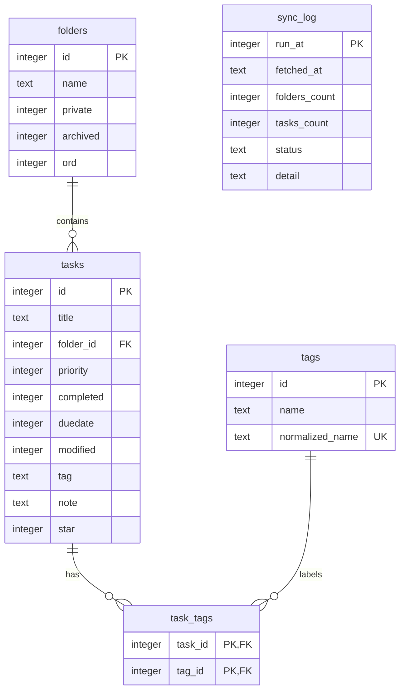

# Toodledo Local Mirror — Design Document

## Goal
Replicate the Toodledo task/folder store into a local SQLite database for flexible
querying and analysis. The mirror is **read-only** for consumers and updated only
via a **periodic sync** process; no write-back to Toodledo.

## Requirements (decided)
1. Accessible from any machine on the home network (Windows, Linux, macOS).
2. Read-only access for all clients except the sync process.
3. No write-back to Toodledo — this is a one-way mirror for analysis/reporting.
   Edits continue to go through the live Toodledo MCP tools.

## Architecture decisions (decided)
- **Backend**: SQLite file, distributed via a network file share (SMB). Simplest
  option; adequate for thousands of rows and infrequent, mostly-sequential reads.
- **Host location**: lives alongside ToodleAPI on this machine (`V:\Projects\...`),
  shared out to the rest of the home network. Available whenever this PC is on.
- **Sync trigger**: OS-level scheduled task (Windows Task Scheduler), running on
  a fixed interval.
- **Sync strategy**: full re-pull each cycle — wipe and reload `folders` and
  `tasks` from the Toodledo API. Self-healing, correctly handles deletions,
  trivial at this data volume (~thousands of rows / a few MB).

## Resolved implementation decisions

1. **Sync cadence** — daily scheduled sync, with an on-demand CLI command:
   `td mirror sync`. On Windows, the daily task can be registered with
   `deploy/windows/register-toodledo-mirror-sync.ps1`.
2. **Storage layout** — mirror artifacts live in the repo's `mirror/`
   subdirectory. The published SQLite file is `mirror/toodledo.db`, exports are
   written under `mirror/exports/`, and sync activity is appended to
   `mirror/sync.log`.
3. **Portability** — the SQLite DB is a single-file artifact. It can be copied to
   another directory or system and read by SQLite on Windows, Linux, or macOS.
   Network clients should prefer read-only SQLite URI access.
4. **Share configuration** — which folder gets shared, what share name/permissions,
   and how do Linux/macOS clients mount it (SMB path vs. `mount -t cifs` vs. Finder
   "Connect to Server")? Needs to be documented per-OS.
5. **Concurrent read safety** — import writes to a temp SQLite file and replaces
   the live DB only after a full successful build. Readers should open the DB in
   read-only mode, ideally with `?mode=ro&immutable=1` when appropriate.
6. **Schema shape for `tag`** — keep Toodledo's raw comma-separated `tasks.tag`
   value and also populate normalized `tags` / `task_tags` tables for exact tag
   queries.
7. **Field set to mirror** — mirror incomplete tasks with
   `id, title, modified, completed, priority, folder, tag, duedate, note, star`.
8. **Folder hygiene** — faithful import. Duplicate and near-duplicate folders are
   reproduced exactly as Toodledo returns them.
9. **Failure handling** — leave the previous DB intact unless fetch and import
   both succeed. Append successes/failures to `mirror/sync.log`.
10. **Sync history / auditability** — each successful published DB includes a
   `sync_log` table with timestamp and row counts.
11. **Client tooling** — will clients query the SQLite file directly (e.g. via
   `sqlite3` CLI, DB Browser for SQLite, a script), or is a thin read-only query
   helper/view layer wanted so non-technical access is easier across platforms?

## Proposed schema (draft, pending decisions above)



```sql
CREATE TABLE folders (
    id        INTEGER PRIMARY KEY,
    name      TEXT NOT NULL,
    private   INTEGER NOT NULL,
    archived  INTEGER NOT NULL,
    ord       INTEGER NOT NULL
);

CREATE TABLE tasks (
    id         INTEGER PRIMARY KEY,
    title      TEXT NOT NULL,
    folder_id  INTEGER REFERENCES folders(id),
    priority   INTEGER NOT NULL,
    completed  INTEGER NOT NULL,
    duedate    INTEGER,            -- epoch seconds, 0/NULL = no due date
    modified   INTEGER NOT NULL,   -- epoch seconds
    tag        TEXT,               -- raw comma-separated string
    note       TEXT,
    star       INTEGER
);

CREATE TABLE tags (
    id              INTEGER PRIMARY KEY AUTOINCREMENT,
    name            TEXT NOT NULL,
    normalized_name TEXT NOT NULL UNIQUE
);

CREATE TABLE task_tags (
    task_id INTEGER NOT NULL REFERENCES tasks(id) ON DELETE CASCADE,
    tag_id  INTEGER NOT NULL REFERENCES tags(id) ON DELETE CASCADE,
    PRIMARY KEY (task_id, tag_id)
);

CREATE TABLE sync_log (
    run_at        INTEGER PRIMARY KEY,
    fetched_at    TEXT,
    folders_count INTEGER,
    tasks_count   INTEGER,
    status        TEXT,
    detail        TEXT
);
```

## Proposed sync flow (draft — split into two stages)

Splitting fetch and import into separate steps/scripts avoids hammering the
rate-limited Toodledo API during development/testing of the import logic, and
leaves a raw snapshot on disk for replay/debugging. The two can be chained
together by a wrapper script once both are stable.

**Stage 1 — fetch/export** (`td mirror fetch`)
1. Authenticates via existing `td.auth.ensure_tokens()`.
2. Pulls all folders (`td` folder API) and all tasks (`td.tasks.fetch_tasks`,
   already paginates at 1000/page).
3. Dumps the raw results to a timestamped JSON (or XML) file on disk, e.g.
   `toodledo_export_2026-06-06T120000.json`.
4. This stage is the only one that talks to the Toodledo API — run it as
   infrequently as the rate limit/cadence requires, independent of import testing.

**Stage 2 — import** (`td mirror import`)
1. Reads the most recent (or a specified) export file from disk — no API calls.
2. Writes results into a fresh SQLite file at a temp path.
3. On full success, atomically replaces the live shared `.db` file (decision 3).
4. Records outcome in `sync_log` (decision 8) and/or a log file (decision 7).
5. Can be re-run repeatedly against the same export file while developing/testing
   the import/schema logic, with zero additional API cost.

**Wrapper** (`td mirror sync`)
- Once both stages are stable, a thin wrapper script runs fetch → import in
  sequence as the single entry point invoked by the scheduled task.

**Windows scheduled task**
- The repo includes `deploy/windows/register-toodledo-mirror-sync.ps1` to create
  or update a daily Task Scheduler job named `Toodledo Local Mirror Sync`.
- Manual Task Scheduler setup and maintenance commands are documented in
  `docs/toodledo-mirror-sync.md`.

## Out of scope
- Any write-back path from the mirror to Toodledo (explicitly excluded).
- Editing tasks through the mirror — all edits remain via the Toodledo MCP tools
  against the live API.
